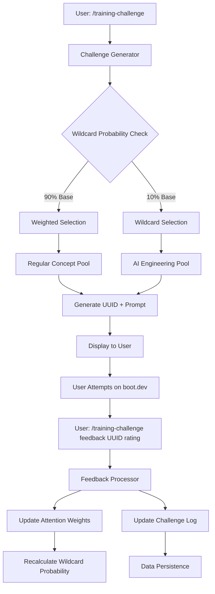

# Training Challenge System Architecture

## Overview

The Training Challenge System is an adaptive spaced repetition system designed to generate programming concept prompts for boot.dev Training Grounds, with intelligent feedback loops and dynamic difficulty scaling for elite AI engineer preparation.

### Design Philosophy

1. **User-Driven Feedback**: Relies on user assessment rather than rigid scheduling
2. **Adaptive Difficulty**: Dynamically adjusts challenge probability based on mastery
3. **Concept-Focused**: Generates high-level prompts that boot.dev expands into full challenges
4. **Elite AI Preparation**: Includes wildcard challenges for advanced AI engineering concepts
5. **ADD-Optimized**: No guilt about missed sessions, practice when motivated

## System Architecture



## Core Components

### 1. Challenge Generator
**Location**: `scripts/training-challenge.js`

**Responsibilities**:
- Determine wildcard probability based on current mastery
- Select concept from regular or wildcard pools
- Generate UUID with appropriate prefix
- Create concept prompt
- Display challenge to user

**Key Functions**:
```javascript
generateChallenge()           // Main entry point
calculateWildcardProbability() // Dynamic probability calculation
selectWeightedConcept()       // Regular concept selection
selectWildcardConcept()       // AI engineering concept selection
generateUUID()               // UUID generation with prefixing
```

### 2. Feedback Processor
**Location**: `scripts/training-challenge.js`

**Responsibilities**:
- Process user difficulty ratings (1-10 scale)
- Update attention weights based on feedback
- Handle wildcard integration into regular rotation
- Trigger skill matrix updates
- Log practice sessions

**Key Functions**:
```javascript
processFeedback(uuid, rating) // Main feedback handler
updateAttentionWeight()       // Weight adjustment logic
integrateWildcard()          // Wildcard to regular promotion
logPracticeSession()         // Activity tracking
```

### 3. Data Persistence Layer
**Location**: `planning/training-challenges/`

**Files**:
- `challenges-log.json` - Complete challenge history
- `attention-weights.json` - Current concept weights
- `wildcard-concepts.json` - AI engineering concept pool
- `system-config.json` - Configuration parameters

### 4. Concept Pools

#### Regular Concepts (Weighted Selection)
Based on your skill matrix and practice history:
- Python fundamentals (functions, data structures, OOP)
- Algorithms and complexity
- Data manipulation and processing
- Testing and debugging
- System design patterns

#### Wildcard Concepts (AI Engineering Focus)
Advanced concepts for elite preparation:
- LLM fundamentals (attention, transformers, tokenization)
- Prompt engineering (validation, optimization, injection detection)
- RAG implementation (chunking, vector search, reranking)
- Neural networks (backpropagation, activation functions)
- Vector operations (similarity, dimensionality reduction)
- ML pipelines (preprocessing, feature extraction, evaluation)

## Dynamic Wildcard Probability System

### Probability Calculation
```javascript
function calculateWildcardProbability() {
  const avgWeight = average(Object.values(attentionWeights));
  
  if (avgWeight < 0.10) return 0.40;      // Mastery Zone - 40%
  if (avgWeight < 0.25) return 0.25;      // Comfort Zone - 25% 
  if (avgWeight < 0.50) return 0.15;      // Learning Zone - 15%
  return 0.05;                            // Foundation Zone - 5%
}
```

### Mastery Zones

| Zone | Avg Weight | Wildcard % | Description |
|------|------------|------------|-------------|
| **Foundation** | ≥50% | 5% | Building basics, minimize wildcards |
| **Learning** | 25-50% | 15% | Balanced practice with stretch goals |
| **Comfort** | 10-25% | 25% | Regular challenges to prevent plateau |
| **Mastery** | <10% | 40% | Advanced challenges for elite preparation |

## Data Flow

### Challenge Generation Flow
1. User executes `/training-challenge`
2. System calculates current wildcard probability
3. Random roll determines regular vs wildcard selection
4. Selected concept generates prompt with UUID
5. User receives formatted challenge for boot.dev
6. System logs generation with metadata

### Feedback Processing Flow
1. User completes challenge on boot.dev
2. User provides feedback: `/training-challenge feedback UUID-xxx rating`
3. System validates UUID and rating
4. Attention weights updated based on rating:
   - 9-10: Very hard → +30% weight
   - 7-8: Challenging → +15% weight
   - 5-6: Just right → no change
   - 3-4: Getting easy → -10% weight
   - 1-2: Too easy → -25% weight
5. Wildcard integration logic if applicable
6. Data persisted to challenge log

### Spaced Repetition Logic
- **Higher attention weight** = higher selection probability
- **Time decay**: Unused concepts gradually increase in weight
- **Success decay**: Mastered concepts decrease in weight
- **Challenge promotion**: Easy wildcards join regular rotation

## Integration Points

### Existing System Integrations

#### 1. Skill Matrix Integration
**File**: `skills/skill-matrix.json`
- Challenge completions update skill evidence
- Practice time tracked per concept
- Wildcard mastery adds new skill categories

#### 2. Victory System Integration
**Trigger Points**:
- First wildcard completion
- Difficult concept mastered (weight drops below 10%)
- Consistency streaks (7+ days of challenges)
- AI engineering breakthrough moments

#### 3. Boot.dev Profile Integration
**Via Firecrawl MCP**:
- Dynamic level checking for appropriate difficulty
- Course completion status for concept relevance
- Current XP for progression tracking

#### 4. Daily Checkin Integration
**Data Points**:
- Challenges attempted today
- Difficulty ratings distribution
- Concepts practiced
- Wildcard encounters

## Configuration System

### System Parameters
```javascript
const CONFIG = {
  wildcard_thresholds: {
    mastery_zone: 0.10,
    comfort_zone: 0.25,
    learning_zone: 0.50
  },
  wildcard_probabilities: {
    mastery: 0.40,
    comfort: 0.25,
    learning: 0.15,
    foundation: 0.05
  },
  weight_adjustments: {
    very_hard: 0.30,
    challenging: 0.15,
    just_right: 0.00,
    getting_easy: -0.10,
    too_easy: -0.25
  },
  uuid_format: "UUID-YYYY-MM-DD-###",
  wildcard_prefix: "W"
};
```

### Customization Options
```bash
# View configuration
/training-challenge config

# Adjust wildcard probability for mastery zone
/training-challenge config mastery-wildcard 0.35

# Change weight adjustment sensitivity
/training-challenge config hard-adjustment 0.25
```

## Performance Considerations

### Data Storage
- JSON files kept under 1MB for fast loading
- Archived old challenges after 6 months
- Indexed UUID lookup for O(1) feedback processing

### Concept Pool Management
- Lazy loading of wildcard concepts
- Cached probability calculations
- Efficient weighted random selection

### User Experience
- Sub-second challenge generation
- Clear visual feedback on system state
- Graceful degradation if boot.dev unavailable

## Security Considerations

### Input Validation
- UUID format validation
- Rating range enforcement (1-10)
- Concept name sanitization

### Data Protection
- No sensitive data in challenge logs
- Local storage only (no external APIs except boot.dev)
- Safe prompt generation (no code injection)

## Testing Strategy

### Unit Tests
- Probability calculation accuracy
- Weight adjustment logic
- UUID generation uniqueness
- Concept selection randomness

### Integration Tests
- Challenge generation end-to-end
- Feedback processing workflow
- Data persistence integrity
- System state recovery

### User Acceptance Tests
- Challenge difficulty appropriate for level
- Feedback loop responsiveness
- Wildcard integration effectiveness
- Performance under sustained use

This architecture supports the goal of becoming an elite AI engineer by 2026 through adaptive, engaging practice that scales with your growing expertise while maintaining motivation through intelligent challenge selection.